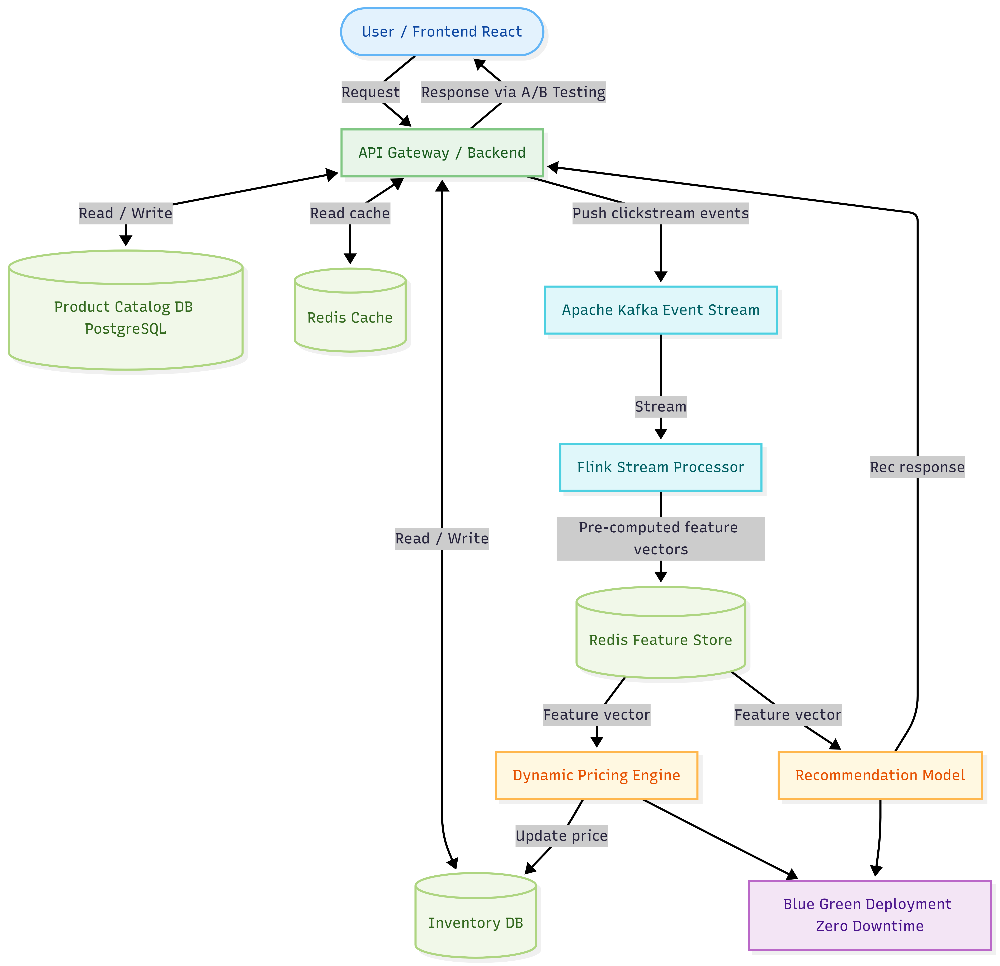
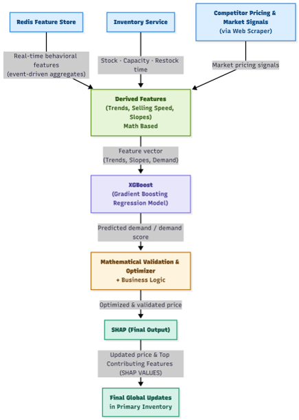
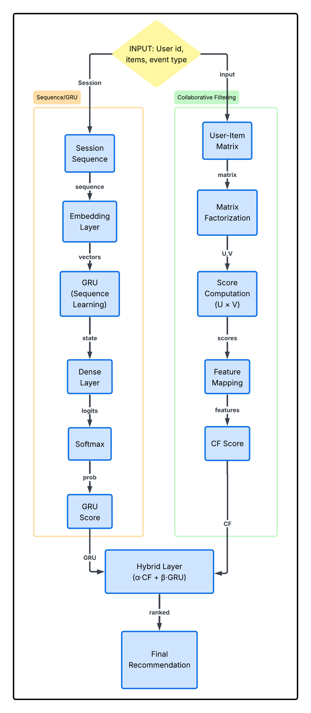

# Dynamic Pricing & Recommendation System

## Overview

A real-time, demand-aware dynamic pricing and recommendation system for large-scale e-commerce platforms.  
The system leverages event-driven architecture, stream processing, and machine learning to deliver:

- Sub-second pricing updates (<200ms)
- Session-based personalization
- Explainable AI using SHAP
- Scalable and fault-tolerant infrastructure

---

## Core Concept

Traditional systems rely on batch-based pricing updates with high latency (typically 24 hours).  
This system enables:

> Real-time pricing combined with session-aware recommendation systems

---

## System Architecture

### Pipeline

1. User Interaction Layer  
   - Captures clickstream data (views, clicks, cart actions)

2. Event Streaming  
   - Apache Kafka handles high-throughput real-time ingestion

3. Stream Processing  
   - Apache Flink computes:
     - session-level features
     - demand signals
     - user intent scores

4. Feature Store  
   - Redis stores real-time feature vectors with low-latency access

5. ML Inference Layer  
   - Demand Prediction: XGBoost (Gradient Boosting Regression)  
   - Recommendation: GRU4Rec (sequence learning) + ALS (collaborative filtering)

6. Pricing Engine  
   - Constraint-based optimization layer  
   - Ensures pricing stability, profitability, and fairness

7. Explainability Layer  
   - SHAP generates feature importance and reasoning

8. Serving Layer  
   - FastAPI backend with Nginx API Gateway

---

## Tech Stack

### Backend and Infrastructure
- FastAPI
- Nginx (API Gateway)
- Docker
- Kubernetes
- Blue-Green Deployment

### Streaming and Processing
- Apache Kafka
- Apache Flink (PyFlink)

### Machine Learning
- XGBoost (Gradient Boosting Regression)
- PyTorch (GRU4Rec)
- ALS (Collaborative Filtering)
- SHAP (Explainability)
- MLflow (Experiment Tracking)

### Storage
- PostgreSQL (Primary Database)
- Redis (Feature Store and Cache)
- ClickHouse (Analytics)

### Scientific Computing
- NumPy
- Pandas
- SciPy
- PyMC

---

## Key Features

- Real-time pricing (<200ms latency)
- Session-based personalization
- Explainable AI using SHAP
- Experiment-driven optimization using A/B testing
- Fault-tolerant pricing system with fallback mechanisms
- Zero-downtime deployment

---
## System Architecture

<p align="center">
  
</p>

*Figure: High-level architecture of real-time dynamic pricing and recommendation system*

---

## Dynamic Pricing Engine (LLD)

<p align="center">
  
</p>

*Figure: Dynamic Pricing Engine pipeline with demand prediction and optimization*

---

## Recommendation System Engine (LLD)

<p align="center">
  
</p>

*Figure: Hybrid recommendation engine combining GRU4Rec and collaborative filtering*

---

## Dynamic Pricing Engine

### Pipeline

- Feature Engineering (trend, slope, demand signals)
- Demand Prediction using XGBoost
- Constraint-Based Optimization
- SHAP Explainability
- Final Price Update

### Safety Layer

- Mathematical validation layer ensures price stability
- Automatic fallback to base price in case of model failure
- Prevents invalid or loss-generating outputs

---

## Recommendation Engine

### Hybrid Model

- GRU4Rec: captures real-time session behavior
- ALS: captures long-term user preferences
- Hybrid Layer: combines both using weighted scoring

---

## Scalability and Reliability

- Supports high-throughput event processing (>1M events/sec)
- Redis enables sub-millisecond feature access
- Stateless microservices allow horizontal scaling
- Blue-green deployment ensures zero downtime

---

## Explainability

SHAP provides:

- Feature importance scores
- Human-readable reasoning for pricing decisions

Example:

```json
{
  "reason": "High demand and low inventory"
}

```
## Industry Comparison

| Traditional Systems        | This System                          |
|---------------------------|--------------------------------------|
| Batch pricing             | Real-time pricing                    |
| Black-box models          | Explainable models (SHAP)            |
| Manual A/B testing        | Automated experimentation            |
| Downtime deployment       | Blue-Green deployment                |

---

## Uniqueness

- Dual-engine architecture (GRU4Rec + ALS)
- Zero-click cold start capability
- Explainable pricing decisions
- Autonomous experimentation framework
- Hybrid architecture inspired by large-scale systems

---

## Team

- Nehanshu Rathod — Machine Learning Engineer  
- Jyot Raval — Machine Learning Engineer  
- Ayaz Deraiya — Backend Developer  
- Kaushik Parmar — Backend Developer  
- Rudra Desai — System Design Architect  


